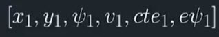
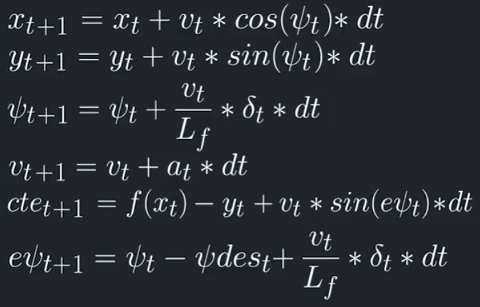
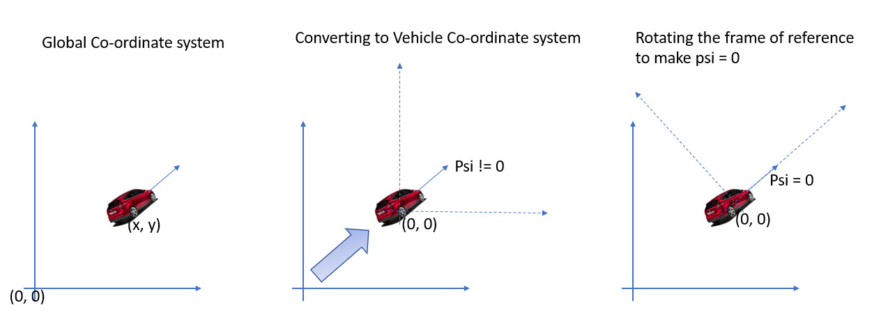

## Self-Driving Car Engineer Nanodegree Program
## Term 2 Project 5
### Model Predictive Controller Project
---
### Writeup Template

The goals / steps of this project are the following:

- Write a Model Predictive Controller for the simulator to predict the steering angle and throttle for the vehicle
- Come up with a cost function that makes the vehicle to run as close as possible to the reference path
- Tune it to stick on to the reference path, avoid sudden jerks or sharp turns

---
#### Rubric Points

All the [rubric points](https://review.udacity.com/#!/rubrics/896/view) are satisfied as part of this project

---

#### Definition

Model predictive control (MPC) is an advanced method of process control that is used to control a process while satisfying a set of constraints. 
The main advantage of MPC is the fact that it allows the current timeslot to be optimized, while keeping future timeslots in account. 
This is achieved by optimizing a finite time-horizon, but only implementing the current timeslot and then optimizing again, repeatedly, thus differing from a PID controller.
 
The basic Intuition of MPC is very simple. If we know the current state and the reference trajectory that we need to follow, we optimize our actuator inputs at each step in time in order to minimize the cost of our predicted trajectory.
Once we find the lowest cost trajectory, we implement the very first step of actuation commands. Then we just ignore the next trajectory, we take the current updated state as the new state and repeat the process once again.
Hence we are constantly calculations actuator values over future horizon. Hence this approach is also sometimes referred to as *Receeding Horizon control*

---

#### Project Explanation

Before we go into the deatils of the project files, here's the model considered in this project

- **State** : This project assumes kinematic model where the only factors considered are position (x, y), velocity, angle of orientation, cross track error & error in orientation.

- **Actuators** : The actuators are the controls that affect the vehicle movement. In this case, we have steering, break and throttle. 

	For simplicity, we can combine break and throttle as a single control where the values can range in [-1, 1].
-1 is complete break and +1 is complete throttle. These are represented by delta & acceleration. Please refer to boundary conditions for some addl info on the values of these controls

- **Update Equations** : This project assumes kinematic model where the only factors considered are position (x, y), velocity, angle of orientation, cross track error & error in orientation. The following equations are used
The following equations are used by the Solve function

- **Receeding Horizon Control** : The reason why this model is called horizon control is that we take into account only certain time steps in future as the current state can affect only upto a certain point and beyond which
the factors that affect the position might vary. Ideally we want to estimate more points in future so that we can get accurate polynomial fit, but its not realistic as it is computationally expensive. Instead, we will choose
an optimum time in future and break them in to appropriate steps.
In this project, I've taken 10 steps in future with a delta of 0.1 second meaning i'm considering 1 second worth of future state into consideration to determine my path. In my view, this is 10 steps and is sufficient enough
to predict the line almost accurately, and at the same time not comupationally intensive. Also the numbers 10 & 0.1 are pretty simple for calculations 

This project consists of 2 files

***main.cpp***

This file talks to the simulator, gets the values from the simulator in the form of a JSON object. This also has code to pass on the predicted points in future as well as the reference points.
This gives us a visual representation of how our controller works. It also sends the steering and throttle commands to the simulator to drive the vehicle

This file contains the following logic

- **polyfit function** : This function is used to generate the best polynomial fit for the given set of points
- **polyeval function** : This function returns the value of the polynomial for a given input value
- **Changing Axes / Frame of Reference** : This is a piece of code within the file where it transforms the global co-ordinate system to vehicle co-ordinate system and the frame of reference is aligned in the direction of velocity. The following figure shows a pictorial representation of the same

- Determining reference & model points : This step involves deteremining the next set of reference points using the polyeval function, and MPC model points using MPC::solve() function

***MPC.cpp***

- **cost function** : The cost function is evaluated in FG_eval::operator() function. There is no specific formula for determining a cost function. A cost function is nothing but the error you see from the desired state.
There could be multiple factors determining how far the vehicle is from the desired position. All the factors contributing to this error could be used to derive the cost function. Also note that not all factors contribute
to the error in the same way. Some factors could affect at a higher rate than others. You can use weights to choose which factors you want to give importance to and give a higher weight to them, while giving lower weights
to those that contribute very less to the error.
For ex, I would consider cross train error and error in orientation as factors that contribute more to the error compared to velocity. Hence I give more weights to cte & epsi.
Similarly, I do not want to have sharp turns or sudden jerks(change in acceleration), hence I would also consider them in my cost function and give appropriate weights to them.
Determining weights is done by intuition and trial-and-error methods. Sometimes you feel something is important, so give higher weights to them and run the process and tune them accordingly.
- **Lower & Upper bounds** : Some values of certain parameters are not realistic - for example, you can never expect a vehicle to take a 90 degree turn. Infact anything over 25 degrees is estimated to be a sharp turn. 
Setting boundaries is a good way of making sure of such things. Lower and uppoer bounds are set to turn angle and throttle as well as constraints.
- **Solve function** : This function models the Model Predictive Controller. It takes in the current state, co-efficients of the polynomial determined for hte vehicle and comes up with the best possible estimate of the 
next set of points as well as other parameters. It also comes up with the steering angle and throttle.

---
###Issues faced
I found issues while installing Ipopt library. It took me a lot of time, but ultimately, it turns out to be pretty straight forward

- sudo apt-get install gfortran
- sudo apt-get install unzip
-  wget https://www.coin-or.org/download/source/Ipopt/Ipopt-3.12.7.zip && unzip Ipopt-3.12.7.zip && rm Ipopt-3.12.7.zip
- sudo install_ipopt.sh Ipopt-3.12.7

---
### Conclusion
This concludes Term 2 Project 5 : Model Predictive Controller Project of Udacity's Self Driving Car Nanodegree Program.